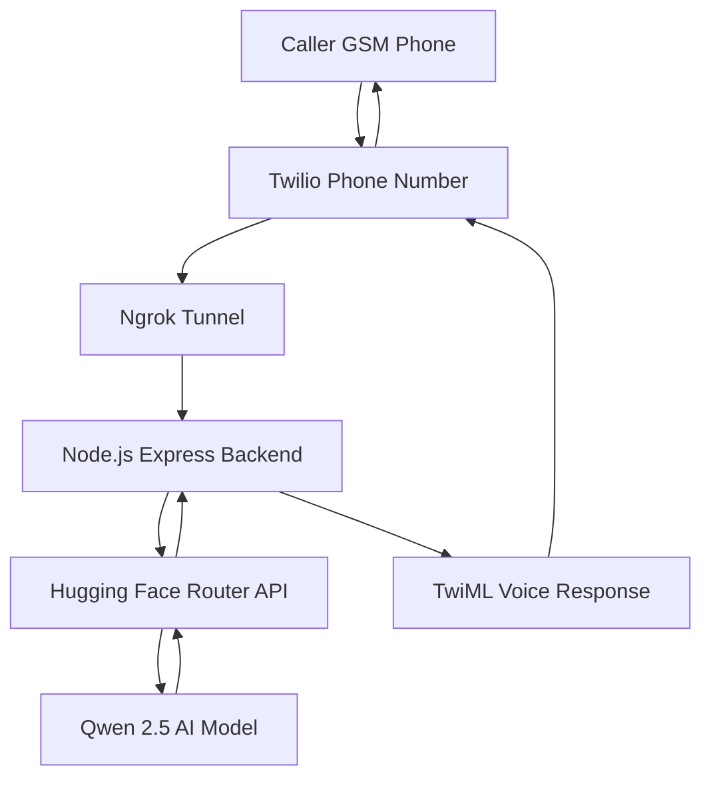

# AI-Powered Voice Call Agent

A cloud-based AI voice agent that allows users to dial a standard phone number and interact with an artificial intelligence system using natural speech via the GSM network.

## Project Details
- Registered Agent Number: +1 831 273 6077
- AI Provider: Hugging Face Router
- AI Model: Qwen/Qwen2.5-VL-7B-Instruct

## System Architecture



## Setup and Installation

Follow these steps to clone and run the project in a new environment.

### 1. Prerequisites
- Node.js installed on your machine.
- A Twilio account with an active phone number.
- A Hugging Face account and API key.
- ngrok installed or accessible via npx.

### 2. Environment Configuration
Create a `.env` file in the root directory and add the following variables:

```env
PORT=3000
TWILIO_ACCOUNT_SID=your_twilio_sid
TWILIO_AUTH_TOKEN=your_twilio_auth_token
HF_API_KEY=your_hugging_face_api_key
HF_MODEL=Qwen/Qwen2.5-VL-7B-Instruct
```

### 3. Installation
```bash
# Install all required dependencies
npm install
```

### 4. Running the Application

#### Option A: One-Click Startup (Recommended)
Run the automation script to start both the backend and the tunnel at once:
```bash
./vision_call_bot.sh
```

#### Option B: Manual Startup
You must keep two processes running simultaneously.

#### Terminal 1: Application Server
```bash
npm start
```
The server will start on port 3000. Access the live call dashboard at: http://localhost:3000/dashboard

#### Terminal 2: Public Tunnel (ngrok)
```bash
# Configure your authtoken if not already done
npx ngrok config add-authtoken your_ngrok_token

# Start the tunnel
npx ngrok http 3000
```
Copy the Forwarding URL (e.g., https://your-unique-id.ngrok-free.app).

### 5. Twilio Webhook Configuration
1. Log in to the Twilio Console.
2. Navigate to Phone Numbers > Manage > Active Numbers.
3. Select +1 831 273 6077.
4. Locate the Voice Configuration section.
5. Set "A call comes in" to: Webhook
6. Paste your ngrok URL with the /voice suffix: `https://your-unique-id.ngrok-free.dev/voice`
7. Set the method to HTTP POST.
8. Save the configuration.

## Development and Testing

### Testing without Telephony
You can test the AI logic and dashboard locally without making a phone call by running the provided simulation script:
```bash
node simulation.js
```

### Stability Notes
- Ensure your .env file is never committed to version control.
- If using the free tier of ngrok, your URL will change every time you restart the process.
- For permanent 24/7 operation, deploy the backend to a cloud provider like Render or Railway and use their static URL in the Twilio webhook settings.
